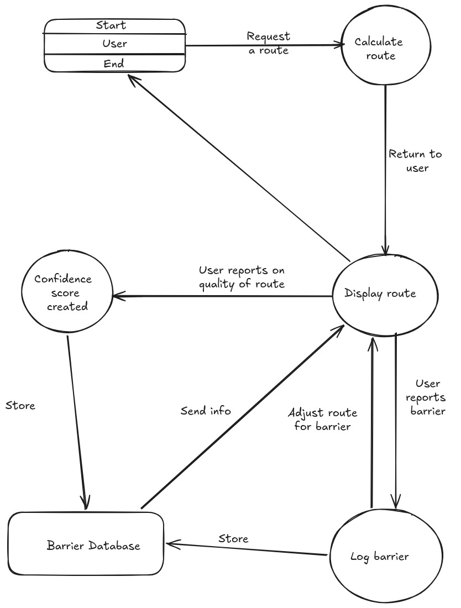

# Group 5 - UCC Accessibility Map

Authors: Conor Power, Gavin O'Keeffe, Jack O'Neil, James Coakley
GitHub repo: [UCC Accessibility Map Repository](https://github.com/GavUCC/UCCAccessibilityMap)

## 1. Introduction

Currently, most online maps available to the public, simply provide them with the shortest route from A to B This project was undertaken as a group to strive for better accessibility options for students with disabilities.

## 2. UCC Accessibility Map

## 2.1 Routing Tools Considered

Before we began coding, we needed to consider how routes would actually be calculated. Standard web mapping libraries like Leaflet can display titles and markers, but they do not generate walking directions themselves. For this we needed a separate routing engine.

**Open Street Map** was initially chosen as the underlying geographic data source. OSM provides, open community maintained street and path data. Its coverage includes footpaths, building outlines, and surface information. Using open data meant the project did not depend on proprietary licensing or paid APIs.

**OSRM (Open Source Routing Machine)** was the first routing engine I used in our initial prototype. OSRM is well known and widely used, as well as this it was straightforward to get basic routing working. However, during testing it became obvious that OSRM's pedestrian routing support was limited. It is primarily designed around vehicle profiles, and its walking mode did give us the control we needed over how routes were calculated. Crucially OSRM did not offer a way to penalize steps, steep gradients or poor surfaces at the routing level. Another issue was its tendency to prefer routing via footpaths that were right on the road. This does not capture the intricacies of routing around a campus as large as UCC.

**GraphHopper** was proposed by Gavin as a replacement GraphHopper supports a foot profile out of the box and more importantly offers a custom model system that allowed us to define priority rules. For example, heavily penalizing routes that include steps or slopes above a certain gradient. This made it a far better fit for the project's goals. Gavin and I setup accounts with GraphHopper and integrated walking routing into the application. Gavin then took the lead on configuring a local server after we became aware of the costs associated with using a custom model hosted on GraphHopper's servers.

## 2.2 Early Routing Approach

The first working prototype of the map was built using Leaflet for the map display and OSRM for route generation. Our initial Goal was to get a basic end to end flow working as quickly as possible: the user clicks two points on the map, the application requests a route and then finally the path is drawn on the screen.

OSRM was a natural starting point because it is one of the most commonly referenced open-source routing engines and a a well documented HTTP API. We were able to basic point to point routing working correctly relatively quickly, with the route rendered as a polyline on the Leaflet map.

However, once we started evaluating the routes it produced, the limitations became apparent. OSRM's pedestrian profile treated campus paths similarly to roads, and there was no mechanism to avoid steps or steep sections. Routes would regularly suggest paths that included staircases or steep inclines, exactly the kind of barriers that the project was designed to help users avoid. OSRM also did not return gradient data in its responses. So even post processing the route for accessibility scoring would have been difficult.

## 3. How the map works

### 3.1 Routing

Routing is the central feature of UCC Access Map. Conceptually, the routing subsystem behaves as a pipeline. A user first chooses a start position and destination, either by either clicking on the map or by selecting building code/name from dropdown menus. These longitudinal and latitudinal coordinates are then sent from the frontend to the local Express server, which forwards the request to GraphHopper. GraphHopper computes a pedestrian route over the prepared Cork City graph and returns a GeoJSON-compatible path with associated metadata such as distance, duration, ascent, and path details. The frontend then renders the resulting route on the Leaflet map and passes the geometry through the accessibility scoring layer to produce warnings and an accessibility rating.

The frontend sends route requests in JSON format. These include the selected profile, start and end points, and the custom route model to use. GraphHopper returns a path containing geometry and routing metadata, which is then consumed by the frontend. The route is displayed on the map as a styled polyline, and additional information such as time, distance, slope, and warnings is shown in the control panel.

From an architectural perspective, the routing layer is deliberately separated from the presentation layer. The browser is responsible for interaction and rendering, the Express server is responsible for request forwarding, and GraphHopper is responsible for pathfinding. This separation keeps the implementation simple while still allowing routing behaviour to be customized for accessibility needs.

### 3.2 Local Server

The need for a local server version of our routing engine became apparent after several weeks of development. Having already built working prototypes utilizing both OSRM and GraphHopper's free tier API, the team realised that even though GraphHopper
offered walking routes, that we could implement, free tier was severely rate-limited and all of the features which we required were paywalled at €500/month. For these reasons, Gavin endeavoured to find a solution to the problem.

The local server acts as the entry point for the application at development time. Rather than having the browser communicate directly with multiple services, the project uses a small Express-based Node server to serve the frontend assets and proxy routing requests to the local GraphHopper instance. This arrangement keeps the deployment model simple: the browser only needs to know about one origin, while the server manages communication with the routing backend.

GraphHopper operates on preprocessed OpenStreetMap data. In this project, a Cork City OSM PBF file was prepared by obtaining UK & Ireland map data from [GeoFabrik](https://GeoFabrik.de) and reducing size by bounding box until the file size was below [GitHub](https://github.com)'s 50MB file size limit. This file was imported into GraphHopper to generate a graph-cache, which is the optimised internal representation used during route calculation. Elevation support was also enabled so that slope-related values could be incorporated into routing decisions. Once imported, the routing engine could answer requests quickly using the prebuilt graph rather than reparsing raw map data each time.

Routing engine called using the following command in bash from within the graphhopper folder:
*"java -jar graphhopper-web-11.0.jar server config.yml"*

If there are any issues running the server, the cache may be deleted and rebuilt:
*"rm -rf graphe-cache"*

The server performs two distinct roles. First, it provides static hosting for the frontend resources. The HTML entry point, JavaScript source files, CSS, and campus assets such as building maps and GeoJSON data are all served locally. Second, it exposes lightweight API endpoints such as `/api/route` and `/api/info`, which forward requests to the GraphHopper server running on a separate local port. In effect, the Express server becomes a small integration layer between the user interface and the routing engine.

To run our Node.js Express server, from project root, in bash enter:
*"npm install"* - first time only
*"npm install multer sqlite3 cors"*
*"npm run dev"*

This design was adopted for practical reasons. Earlier iterations of the project relied on hosted routing APIs, but these introduced restrictions in terms of subscriptions, request limits, and dependency on external infrastructure. Moving to a local server architecture gave the project a self-contained backend that could be run entirely on a development machine. It also simplified frontend development, since the application could issue same-origin requests without needing to solve cross-origin issues in the browser.

Another advantage of the local server is portability. Once the GraphHopper data, configuration, and routing jar were working correctly, the server setup could be shared with the rest of the group as part of the repository. This allowed the application to be reproduced consistently across machines, with the same campus dataset, the same route profiles, and the same frontend behaviour. Should be ready to deploy in anywhere in minutes.

### 3.3 Custom Routes

The main contribution of the routing system is not merely that it can find a path between two points, but that it can adapt this path to different accessibility needs. Rather than treating all users as having the same preferences, the project defines multiple route profiles: a step-free profile intended for wheelchair users, a gentle-gradient profile intended for users who may be using crutches or who experience pain on slopes, and a low-energy profile intended for users who may fatigue easily. Each profile alters the routing behaviour in a different way.

These profiles are implemented using GraphHopper’s custom routing model mechanism. Instead of always minimizing geometric distance, the routing engine is instructed to penalize or deprioritize certain path characteristics. The most obvious example is stairs: for the step-free profile, routes containing steps are strongly avoided. Slope values are also incorporated, so paths with steeper gradients receive lower priority than gentler alternatives. In practice, this produces routes that more closely reflect accessibility needs than a generic pedestrian shortest-path query.

Custom routes are not based solely on the routing engine. After GraphHopper returns a path, the frontend applies an additional accessibility scoring stage. This stage compares the route geometry against a manually curated hazard dataset containing known barriers such as steps, steep sections, narrow paths, missing kerb drops, or poor surfaces. Each active accessibility profile has its own penalty model, so the same route may score differently depending on whether the user is primarily concerned with stairs, gradient, or fatigue. The result is then presented to the user as an accessibility score and a set of warnings.

This two-stage approach was chosen because routing and accessibility are related but not identical problems. The routing engine can avoid many undesirable path features when those features are encoded in the map data, but not all real-world accessibility issues are consistently represented in OpenStreetMap. The post-route hazard scoring layer compensates for this by allowing the project to incorporate locally observed barriers and campus-specific knowledge. In effect, the final route combines algorithmic pathfinding with human-curated accessibility knowledge.

An important practical lesson from this design is that accessibility routing often involves trade-offs. A route that is shorter may not be the most accessible. A route that is possible may still be undesirable if it contains steep gradients or surfaces that are difficult to traverse. By separating route generation from route scoring, the project is able both to compute usable routes while communicating uncertainty or risk to the user.

### Hazards

### Notes

## 4. User Interaction

### 4.1 Main map interaction flow

Figure 4.1 gives a high-level view of how the user-facing route process works. A route is requested, calculated, displayed, and then enriched by barrier reports and user feedback. This is useful because it shows that the system is not limited to route generation alone. It also records information about route quality and reported accessibility issues, which makes the application more reflective and more realistic over time.
The main interaction flow of the application is designed around a simple sequence: the user selects a start point, selects an end point, chooses an accessibility profile and requests a route. The interface provides immediate visual feedback at each step.

#### 4.1.1 **Selecting Points**

In the default "Click Map" routing mode, the user clicks anywhere on the map to set a start point (shown as a green circle). A second click sets the end point (red circle). The control panel on the left updates to display the coordinates of each selected point and a visual highlight indicates which point is expected next. If the points are already set and the user clicks again, the start point resets and the process begins fresh. The keeps the interaction predictable without requiring a separate "reset" step for every attempt.

#### 4.1.2 **Building mode**

As an alternative to clicking the map directly, the user can switch to "Building" routing mode using the radio buttons in the control panel. In this mode, two dropdown menus appear, populated with the building codes and names extracted from the GeoJSON data. The user selects a start building and an end building from the lists and the application places the start and end markers at the centre of each building polygon. A swap button allows quick reversal of each selection.

#### 4.1.3 **Generating a route**

Once both points are set, the "Get Route" button becomes active. Clicking it sends a routing request through the backend to the local GraphHopper server. While the route is being calculated, a status message is displayed. When the route returns, it is drawn on the map as a coloured polyline. Green for high accessibility, orange for medium and red for low. The map also automatically zooms to fit the route.

#### 4.1.4 **Viewing Results**

After a route is generated, the control panel shows the distance, estimated walking time and an accessibility score out of 100 with a confidence level. Below this any warnings are listed. For example, steep sections, steps near the route or user reported barriers. Turn by turn directions are also displayed in a collapsible panel with each instruction showing the distance and time for that segment.

#### 4.1.5 **Clearing**

The "Clear" button resets all state: markers, route, directions, score and the map returns to its default view centred on UCC.

### 4.2 User Interface Design Choices

The interface was deliberately kept simple. The map takes up the full viewport with a floating control panel positioned in the top left corner. This layout ensures that the map (the most important element) is always visible and the controls do not obscure the route.

#### 4.2.1 **Separation of Modes**

Routing and barrier reporting are handled as distinct interaction modes. In routing mode, map click sets start and end points. In reporting mode a click instead opens the barrier submission model. The separation prevents accidental barrier reports when the user intends to set a route point and vice-versa. A status message always indicates which mode is active so the user knows what a click will do.

#### 4.2.2 **Routing Information Presentation**

Rather than showing raw data, the route panel translates the accessibility score into a plain language level with a corresponding colour and symbol. Warnings are presented with severity icons, red, orange or yellow circles and each includes a short explanation of the issue with a practical note. This approach was chosen so that user do not need to interpret numbers, the interface communicates the meaning directly.

#### 4.2.3 **Profile Selection**

The mobility profile dropdown sits prominently in the control panel above the point selectors. Three profiles are currently available, step free (wheelchair), gentle gradient (crutches/pain) and low energy/fatigue. Each describes in plain terms so that users can choose without needing the technical knowledge of how the scoring works.

#### 4.2.4 **Feedback Placement**

The route feedback form only appears after a route has been generated, positioned in the top-right corner of the map. This keeps it out of the way during route planning but makes it easy to find once the user has a route to evaluate. The form is minimal, name(optional), a 1-5 rating and an optional comment to reduce friction

## 5. Testing and Validation

## 5.1 Routing Validation

Routing was validated through a combination of manual testing and visual inspection rather than automated unit tests, which was appropriate given the project's scope and timeline.

**Route generation**
We tested that routes could be successfully generated between a range of point pairs across campus, including pairs that were close together, far apart, on opposite sides of steep sections, and between buildings with known accessibility barriers. Each request was checked to confirm that a valid GeoJSON LineString was returned and that the route rendered correctly on the map.

**Route rendering**
The displayed polyline was visually compared against the expected path on the OSM base map. In several cases early routes would cut across buildings or follow roads rather than footpaths, which indicated issues with the underlying OSM data or GraphHopper's graph preparation. These were corrected by Gavin through modifications to the OSM dataset used for graph generation.

**Profile behaviour**
Routes were generated for the same start and end points using each of the three accessibility profiles (Step-free, Gentle Gradient, Low Energy) to confirm that different profiles produced different routes or different scores where expected. For example, a route passing near the Main Quadrangle steps should receive a much lower score under the Step-free profile than under the Low Energy profile and this was verified.

**Hazard detection.** Known hazard locations from accessibility-data.js were cross-referenced against generated routes. When a route passed within the defined radius of a hazard (for example, the steps at the Orb), the corresponding warning was checked to appear in the route information panel with the correct severity level and description.

## 5.2 Frontend Interaction Testing

**Point setting**
We verified that clicking the map correctly placed a green start marker on the first click and a red end marker on the second click, that coordinates updated in the control panel and that a third click reset the start point. We also tested that switching to building mode disabled map-click point placement and that the dropdown selectors correctly set markers at building centres.

**Route display and clearing**
After generating a route, we checked that the polyline appeared with the correct colour corresponding to the accessibility score, that distance and time were displayed, that warnings appeared when expected and that turn-by-turn directions were populated. The "Clear" button was tested to confirm it removed all markers, the route line, directions, warnings, and score, and returned the map to the default view.

**Reporting mode interaction**
We tested that clicking "Report Barrier" activated reporting mode (confirmed by the status message), that a map click in this mode opened the barrier modal rather than setting a routing point, and that submitting or closing the model returned the application to its normal state. We also verified that after submitting a barrier report, the new barrier marker appeared on the map without requiring a page refresh.

**Edge cases**
Testing included attempting to generate a route with only one point set (the button remains disabled), submitting a barrier report with missing required fields (the form prevents submission) and rapidly switching between routing mode and building mode to check for leftover state from the previous mode.

## 6. Technical Challenges & Lessons Learned

### 6.1 Personal Reflection (Gavin)

My biggest lesson throughout the development of this application was to **expect the worst** while planning. I had entered this project somewhat naively thinking that the features we would looking for would be readily available and not too expensive. However, upon development, the need for a local workaround became a top priority due to only a single routing provider having the route options we needed and they were locked behind paywall. Thankfully, I was able to use GraphHopper 11's Java archive file to run a GH server locally. This however took a lot of time from other tasks I would have liked to develop further such as alternative routing and added functionality for visually impaired users.

### 6.2 Personal Reflection (Conor)

#### 6.2.1 Routing Engine Challenges

**OSRM limitations**
As described in Section 6.1, the initial OSRM integration produced working routes but lacked any mechanism for penalising accessibility barriers. Identifying this early saved time, but it did mean the routing layer had to be rebuilt around a different engine.

#### 6.2.2 Frontend Interaction Challenges

Several frontend bugs emerged during development, particularly around the interaction between routing and barrier reporting.

**Marker state issues**
Early versions had a problem where clicking the map in reporting mode would also set or overwrite a routing point. This happened because both the routing click handler and the reporting click handler were listening to the same map click event. The fix was to check reportingMode at the top of the click handler and return early if it was active, so that routing point logic is completely skipped during barrier placement. Similarly, in building mode, map clicks are intercepted to prevent accidental point placement, the user is instead prompted to use the dropdown selectors.

**Route refresh and request timing**
When the user changed the mobility profile or moved a point and immediately clicked "Get Route", there were cases where an older routing response would arrive after a newer one, causing the displayed route to be out of date. This was partly a timing issue with asynchronous fetch calls. While a full request cancellation system was not implemented, the team addressed the most visible cases by clearing the existing route layer before each new request and ensuring the status message reflects the current state.

**JSON parsing issues**
During integration, there were intermittent errors where the frontend would fail to parse the routing response. These were traced to cases where GraphHopper returned an error response (for example, when no route could be found between two points) that was not valid JSON in the format the frontend expected. The fix involved checking response.ok before attempting to parse and providing a clear error message to the user when routing failed.
## 7. Barrier Reporting, Admin Review, and User Feedback

### 7.1 Why Barrier Reporting and Feedback Were Needed

One of the biggest problems with accessibility information is that it can go out of date very quickly. A map can show buildings, roads, and paths, but that does not mean it reflects what users actually experience on the ground. A route that looks fine in theory can become awkward or completely unusable because of temporary construction, blocked footpaths, uneven paving, or a route detail that was never captured properly in the first place.

This mattered a lot for our project because the goal was never just to draw a line between two points. The goal was to help users choose routes that are more realistic for their mobility needs. A normal routing engine can return a route that is mathematically valid, but that does not mean it is genuinely accessible. That gap between map data and lived experience is where barrier reporting and user feedback became important.

Barrier reporting gives the user a way to tell the system that something on campus does not match the ideal version of the map. User feedback adds another layer by allowing someone to say whether a generated route was actually useful or not. Together, these features make the system more than a static route planner. They turn it into a small feedback-driven system that can start to reflect real conditions instead of assuming the original dataset is always correct.

The combined diagram above shows the main idea behind this part of the project. On the left, once a route is requested and displayed, the user can report a barrier that affects route quality. That barrier is logged and stored, which means the system can later use that information when routes are generated again. On the right, once a route has been generated, the user can also rate it and leave a comment. That feedback is stored separately and gives the project a way to record how useful the route felt in practice.

This was one of the more important ideas in the project because accessibility cannot really be treated as a once-off calculation. Campus conditions change. Temporary barriers appear. Some routes are technically possible but still not comfortable or reliable. The reporting and feedback side of the system helps deal with that uncertainty in a way that the routing engine alone cannot.

Another reason this mattered is that it gave the project a stronger user-centred focus. Instead of the application simply telling users what route to take, it also allows users to tell the application when something is wrong or when a route did not work as expected. That makes the system feel more realistic and more useful. The user is not just following the route. They are also helping improve the route information for future use.

### 7.2 Barrier Reporting Workflow

The barrier reporting workflow was designed to be simple enough that a user could complete it quickly while still submitting information that is meaningful. If the process is too awkward or takes too long, people simply will not use it. That would defeat the point of the feature, so the reporting flow was kept focused and direct.

The first step is switching into reporting mode. This is important because the map already has a routing mode where clicks are used to place start and end points. If the system does not clearly separate those two actions, then a click on the map can accidentally do the wrong thing. During development, making sure reporting mode and routing mode stayed separate was one of the practical frontend issues that had to be solved.

Once reporting mode is active, clicking the map opens the barrier submission form rather than placing a routing point. The location is captured directly from the click, so the user does not need to describe the position manually or enter coordinates themselves. That makes the process faster and also makes the submitted data more precise.

The form itself collects a small but useful set of inputs. The user can select the barrier type, choose a severity level, attach an optional photo, and add a short description. This was a good balance between usability and detail. It gives the system enough information to understand the issue without forcing the user to complete a long form.

The type of barrier matters because different barriers affect different users in different ways. A staircase is a major issue for some users, while a steep slope or uneven surface may matter more for others. By explicitly recording the barrier type and severity, the project creates a better basis for judging route quality later on.

Once the user submits the form, the data is sent through the backend and stored. In the current project this happens through the Express server in `server.js`, with barrier information stored in the SQLite database. The stored data includes location, type, severity, description, status, timestamp, and image path when a photo has been uploaded. This is important because it means the report is not just a temporary front-end marker. It becomes part of the system’s persistent data.

That persistence matters for two reasons. First, the barrier can still be present when the page is reloaded or when another user opens the application. Second, it allows later review and management rather than treating every report as something that is visible forever without question.

This workflow was one of the stronger parts of the project because it takes a fairly simple user interaction, a click on the map and a short form, and links it to a meaningful backend process. The user sees something small and simple. Underneath that, the project captures useful data that can support route interpretation later on.

### 7.3 Admin Review and Barrier Management

Once users can report barriers, the next question is what happens to those reports afterwards. If the project accepted every report but provided no way to review or resolve them, then the system would quickly become messy. Barriers that were temporary would remain active forever, duplicate issues would build up, and route information would become harder to trust.

For that reason, the project also included support for admin-side barrier management. It is important to describe this honestly. The current system does not have a fully separate polished admin dashboard with accounts, permissions, analytics, and all the machinery of a production application. That would have been far beyond the scope of the module. What it does include is backend support for reviewing barrier data and updating barrier status.

In practice, this means that a reported barrier is not simply submitted and forgotten. It can move through a basic lifecycle such as pending, in review, or resolved. That may seem like a small feature, but it is actually quite important. It means the project treats barrier data as something that can change over time rather than as fixed truth.

This was one of the areas where the design had to stay pragmatic. A full admin system would have taken too much time and shifted the project away from its main focus. Instead, the project concentrated on the underlying mechanics that really matter. If a barrier can be stored, reviewed, updated, and resolved, then the system already has the beginnings of a meaningful management process.

Another important point is that this supports trust. If users are going to report problems, they need to feel that those problems can be checked or resolved later. Even a lightweight admin-side workflow gives the system more credibility than a one-way submission form with no follow-up path.

This also links back to the quality of routes. If a route repeatedly passes through an area with unresolved barriers, the system should not treat that route in the same way as a clean path. The admin review and barrier status side of the system supports that broader idea, even if it is still lightweight in its current form.

Although this report does not include a separate screenshot of the admin-side controls, the implemented backend endpoints support review and resolution actions for reported barriers, which allows the application to move beyond simple submission and towards basic barrier management.

### 7.4 User Feedback and Route Confidence

Barrier reporting captures specific obstacles, but it does not tell the whole story. A route can still feel poor even if no single barrier has been reported. It may be awkward, tiring, confusing, or simply less comfortable than another option. This is why user feedback was added as a separate feature.

The feedback form appears after a route has been generated. This timing is deliberate. It makes sense to ask for feedback only after the user has actually seen the route and its route information. Once the route is displayed, the user can leave an optional name, a rating, and a comment about the route.

This screenshot shows why the feedback system fits naturally into the rest of the interface. The route is displayed, warnings are listed, the score is visible, and the feedback box appears in the same workflow. The user does not need to open a separate page or perform a detached action. Feedback is part of the route experience itself.

On the backend, this feedback is stored in SQLite through the feedback API. In the current project this includes a name field, rating, comment, and submission timestamp. That means the system can retain user responses over time rather than simply showing the form as a dead-end interaction.

The value of this feature is that it captures something different from barrier reports. Barrier reports point to a specific issue, such as construction, steps, or a blocked path. Feedback captures the broader experience of using the route. A route may not contain a single dramatic barrier but may still feel poor overall. On the other hand, a route may include warnings and still be considered usable. Feedback gives the system a way to preserve that more human judgement.

This connects closely to the idea of route confidence. In the current project, feedback is stored and retrievable, but it does not yet recalculate route scoring in a fully automatic way. Even so, the project lays the groundwork for that future direction. The system now has a place to store how users judged a route, and that is the first necessary step if route confidence is to become more sophisticated later.

From a software engineering point of view, this improves the balance of the project. Without feedback, the system is mostly predictive. It generates a route and tells the user what it thinks. With feedback, the system becomes reflective as well. It begins to record where that route advice matched reality and where it did not.

### 7.5 Why This Part of the System Matters

Taken together, barrier reporting, admin review support, and user feedback are some of the most important features in the whole project. They move the application beyond static map display and into something more dynamic. A campus accessibility map is only genuinely useful if it can account for the fact that accessibility is not fixed. Conditions change. New barriers appear. Old barriers are resolved. Some routes that look fine in theory still turn out to be inconvenient in practice.

That is why this part of the project matters so much. It gives the system memory, and more importantly, it gives that memory a connection to user experience. The routing engine and accessibility scoring provide one side of the project. They handle calculation. Barrier reporting and feedback provide the other side. They bring in reality.

This section also helps explain why the application is more than a route-drawing tool. The project is trying to reduce uncertainty. A user should not have to discover accessibility problems only after they have already committed to a route. By allowing barrier submission and route feedback, the system starts to move towards something more useful and more humane.

There is still a lot of room for future work. A stronger standalone admin interface would make review easier. Feedback could be tied more directly to specific route profiles or route histories. Confidence scoring could become more sophisticated. Temporary barriers could expire automatically if they are not re-reported. But those future improvements only make sense because the basic feedback loop now exists.

In short, this part of the project captures one of the main ideas behind the whole system. Accessibility cannot be treated as a one-time calculation. It has to be treated as an ongoing relationship between route data, software logic, and the people who actually move through the campus.
## 8. Conclusion
This project showed that accessibility-aware navigation is a much richer problem than simply drawing a route between two points. Standard routing can identify where a path exists, but it does not necessarily explain whether that path is realistic, safe, or comfortable for the person using it. By combining route generation with accessibility scoring, hazard-aware logic, barrier reporting, and user feedback, the UCC Accessibility Map moves closer to a system that can reflect real movement across campus rather than idealised map geometry alone.

One of the clearest lessons from the project was that accessibility cannot be treated as an abstract idea. Going around campus with Patrick, a wheelchair user, made that obvious. It exposed the difference between routes that exist in theory and routes that actually work in practice. In particular, the experience around the Kane Building highlighted how visible and frustrating those gaps can still be. That gave the project a stronger purpose and pushed it beyond a purely technical exercise. It also created a path forward beyond the software itself, with James due to meet Tony Carey, Head of Buildings and Estates, to discuss what action can be taken.

From a technical point of view, the project developed from a simple routing prototype into a more complete system. The early OSRM-based approach was useful because it proved that routes could be generated and displayed, but it also exposed the limits of general-purpose routing for accessibility-focused use. The move to GraphHopper, together with the local backend server, route profiles, hazard interpretation, and persistent storage for barriers and feedback, gave the application a much stronger architectural foundation. This is one of the main achievements of the project, because it shows how accessibility concerns can be built into the logic of the system rather than added as an afterthought.

The project also demonstrated the importance of user contribution. Barrier reporting and feedback do not simply add extra form fields to the application. They allow the system to represent real conditions more honestly. A route can now be judged not only by geometry but also by warnings, reported issues, and user experience. That makes the map more dynamic, more useful, and more grounded in reality.

Jack’s contributions also helped keep the system practical for real campus use. Verification of building data, route reconnaissance, and floor plan support all made the application more usable from a student’s point of view. This matters because an accessibility tool only becomes meaningful when people can connect the software’s route suggestions to the spaces they are actually trying to reach.

There is still plenty of scope for future work. A fuller admin interface, richer route-specific feedback, stronger confidence modelling, and broader campus data coverage would all improve the system further. Even so, the project already demonstrates something valuable: accessibility information becomes much more meaningful when it is treated as local, changing, and shaped by real experience. Ultimately, the UCC Accessibility Map is not only about finding a route. It is about helping ensure that the route is trustworthy, realistic, and dignified for the person who has to use it.
## 9. Tasks & Attributions

### Pre-Development

| Task                                           | Completed by      |
|------------------------------------------------|-------------------|
| Project suggestions & Voting                   | Team |
| Reconnaissance (walking campus routes)         | Jack              |
| Guided Recon                                   | James             |
| Similar Project Research                       | James             |
| Free Map API research                          | Gavin             |
| Javascript Library Research                    | All               |
| Building geometry acquired from Overpass Turbo | Gavin & Jack      |
| Floor Plans acquired                           | Gavin & Jack      |
| Manual slope calculations                      | Gavin             |
| Investigate free routing tools                 | Gavin             |
| Prototyping                                    | Conor             |
| Evaluate possible storage systems              | Team              |
| Initial routing feasibility investigation      | Gavin             |
| Accessibility considerations research          | James & Jack      |
| Verification of building data and locations    | Jack              |

### System Design

| Task                                                              | Completed by  |
|-------------------------------------------------------------------|---------------|
| OpenStreetMap, Leaflet, OSRM proposed & accepted                  | Gavin         |
| GraphHopper proposed to replace OSRM                              | Gavin         |
| Accounts set up with GraphHopper and walking routing added        | Conor & Gavin |
| Accessibility hazard scoring system designed                      | Gavin         |
| Route profiles designed (Step-free, Gentle Gradient, Low Energy)  | Gavin         |
| GeoJSON schema for building data designed                         | Gavin & Jack  |
| GraphHopper local server architecture designed                    | Gavin         |
| Accessibility hazard dataset structure designed                   | Conor         |
| Routing system architecture designed                              | Gavin & Conor |
| Barrier reporting system design                                   | James         |
| Barrier report data schema design                                 | James         |
| Barrier data freshness and expiry model design                    | James         |
| User feedback and crowd validation concept design                 | James         |
| Admin barrier review workflow design                              | James         |

### Development

| Task                                                                  | Completed by  |
|-----------------------------------------------------------------------|---------------|
| First prototype map                                                   | Conor         |
| Added OSRM routing                                                    | Conor         |
| Identified OSRM vehicle-only routing limitation                       | Conor & Jack  |
| Evaluated alternative routing engines                                 | Gavin         |
| GraphHopper local routing server setup                                | Gavin         |
| Created GraphHopper configuration file                                | Gavin         |
| OSM dataset preparation for routing & accessibility features          | Gavin         |
| Integrated GraphHopper routing with frontend                          | Gavin & Conor |
| Designed accessibility hazard dataset                                 | Gavin         |
| Implemented hazard penalty scoring system                             | Gavin         |
| Implemented accessibility routing profiles                            | Gavin         |
| Added wheelchair accessibility & opening hours metadata to buildings  | Gavin         |
| Implemented building popup information system(broken)                 | Gavin & Jack  |
| Integrated building floor plans popup to open in new tab              | Jack          |
| Implemented routing between building codes                            | Gavin         |
| Added building selection routing interface                            | Gavin         |
| Repository branch management and pull requests                        | Gavin & Conor |
| GraphHopper elevation data integration                                | Gavin         |
| Generated and optimised GraphHopper routing graph                     | Gavin         |
| Implemented accessibility route selection interface                   | Team          |
| Integrated route hazard highlighting                                  | Team          |
| Backend routing server integration with frontend application          | Gavin         |
| Implemented barrier reporting interface                               | James         |
| Implemented map-based barrier marker placement                        | James         |
| Implemented reporting mode interaction logic                          | James         |
| Implemented barrier reporting UI controls                             | James         |
| Implemented barrier report data structure (temporary storage)         | James         |
| Separated routing interaction from reporting interaction              | James         |
| Implemented barrier status management and admin review endpoints      | James         |
| Implemented SQLite storage and API support for user feedback          | James         |

### Testing

| Task                                                   | Completed by  |
|--------------------------------------------------------|---------------|
| Accessibility routing validation                       | Gavin & Conor |
| Hazard detection testing                               | Team          |
| Frontend route rendering tests                         | Team          |
| Map data accuracy checks                               | Gavin & Jack  |
| Debugged routing marker state issues                   | James & Gavin |
| Investigated route refresh failures and request timing | James         |
| Investigated frontend JSON parsing issues              | James         |
| Debugged routing marker behaviour and snapping issues  | James         |
| Field validation of accessibility observations         | Jack          |
| Verification of accessibility hazards and locations    | Jack & Conor  |

### Delivery

| Task                                  | Completed by  |
|---------------------------------------|---------------|
| GitHub repository organisation        | Gavin & Conor |
| GraphHopper server setup instructions | Gavin         |
| Project documentation                 | All           |
| README documentation                  | Gavin         |
| Repository preparation for submission | All           |
| Final Report Delivery                 | All           |
## 10. References

- OpenStreetMap. https://www.openstreetmap.org/
- GraphHopper Documentation. https://www.graphhopper.com/
- Leaflet Documentation. https://leafletjs.com/
- Express Documentation. https://expressjs.com/
- SQLite Documentation. https://www.sqlite.org/docs.html
- GeoFabrik. https://download.geofabrik.de/
- The Architecture of Open Source Applications. http://www.aosabook.org/
